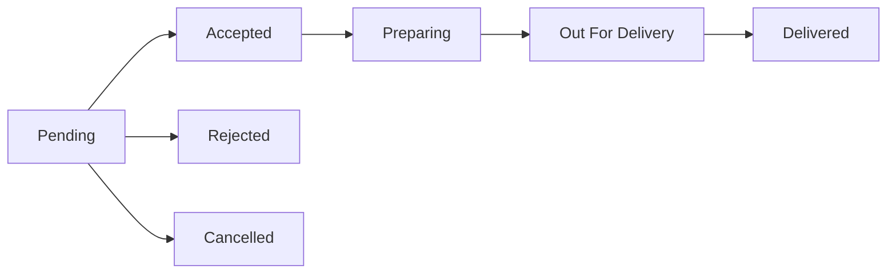
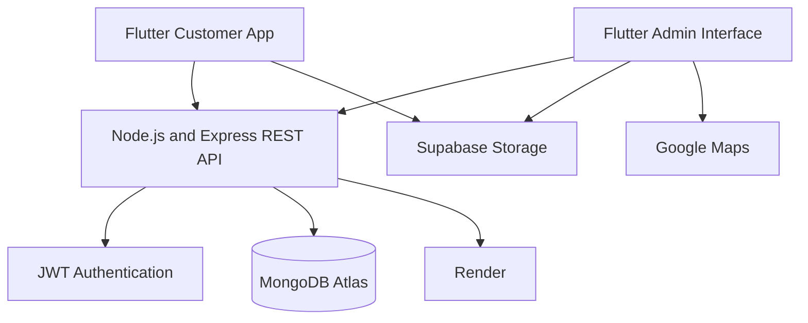

<div align="center">

# Food Delivery System

### Production-ready single-restaurant food ordering and management application

Built with **Flutter, Riverpod, Node.js, Express, TypeScript, MongoDB Atlas, Supabase Storage and Render**.

[](https://flutter.dev/)
[](https://dart.dev/)
[](https://nodejs.org/)
[](https://expressjs.com/)
[](https://www.typescriptlang.org/)
[](https://www.mongodb.com/)
[](https://supabase.com/)
[](https://render.com/)

</div>

---

## Overview

**Pawan Biryani Food Delivery System** is a full-stack restaurant ordering application developed for a real local restaurant.

Customers can browse categorized menu items, check item availability, add food to the cart, provide their delivery location and place Cash on Delivery orders.

Restaurant administrators can manage menu items, upload food images, create categories, control restaurant availability, view incoming orders, update order statuses, track customer locations and monitor revenue.

The system is designed for a single restaurant and supports real business operations.

---

## Live Project

| Resource | Link |
|---|---|
| GitHub Repository | [FoodDelivery-System](https://github.com/bipulkumar62/FoodDelivery-System) |
| Backend API | [pawan-backend-2.onrender.com](https://pawan-backend-2.onrender.com/) |
| Health Check | [Backend Health](https://pawan-backend-2.onrender.com/health) |
| Public Menu API | [Menu API](https://pawan-backend-2.onrender.com/api/v1/menu) |

> The Android application is distributed through Google Play testing tracks.

---

## Core Features

### Customer Features

- Browse the complete restaurant menu
- View dynamic menu categories
- Filter food items by category
- View food name, description, image and price
- View available and sold-out items
- Add available products to the cart
- Increase or decrease item quantity
- Automatic menu refresh without restarting the application
- Real-time menu synchronization using REST polling
- Preserve cart data during navigation
- Validate unavailable items before checkout
- Enter customer name, phone number and delivery address
- Capture latitude and longitude
- Validate the 15-kilometre delivery radius
- Calculate distance-based delivery charges
- Place Cash on Delivery orders
- View order history using a phone number
- View order date, time, total amount and status
- View a centered restaurant offline message
- Automatically restore ordering when the restaurant comes online

### Admin Features

- Secure restaurant administrator login
- JWT-based authentication
- View all customer orders
- View customer information and delivery address
- Open customer coordinates in Google Maps
- Accept or reject orders
- Update order status
- View daily revenue
- View real order date and time
- Add new menu items
- Edit existing menu items
- Upload menu images
- Update food names, descriptions and prices
- Assign dynamic categories
- Mark items as available or sold out
- Archive unwanted menu items
- Prevent archived items from appearing to customers
- Enable or disable restaurant ordering
- Automatically synchronize menu changes with Customer Home

---

## Dynamic Category System

Menu categories are generated automatically from active menu items.

Example:

```text
All | Biryani | Roll | Combo | Drinks
```

When an administrator adds:

```text
Name: Chicken Roll
Category: Roll
```

The application automatically:

1. Saves the category with the menu item
2. Updates Admin Menu Management
3. Refreshes the public menu
4. Adds `Roll` to the category selector
5. Displays only Roll items when the customer selects it

Category names are normalized to prevent duplicates caused by uppercase, lowercase or extra spaces.

These values are treated as the same category:

```text
roll
Roll
ROLL
 roll
```

Final displayed category:

```text
Roll
```

---

## Menu Synchronization

The Customer Home menu automatically refreshes when:

- Home screen opens
- Application returns from the background
- Menu polling runs while Home is visible
- Administrator adds a new item
- Administrator edits an item
- Administrator changes an image
- Administrator changes a price
- Administrator changes a category
- Administrator marks an item as sold out
- Administrator archives an item
- Restaurant availability changes

```text
Admin updates menu
        ↓
Backend updates MongoDB
        ↓
Public menu API returns latest data
        ↓
Riverpod provider refreshes
        ↓
Customer Home updates automatically
```

---

## Menu Item States

The system separates item visibility from item availability.

| isActive | available | Customer Result |
|---|---|---|
| `true` | `true` | Item is visible and orderable |
| `true` | `false` | Item is visible with SOLD OUT status |
| `false` | `false` | Item is archived and hidden |

Archived items are not permanently deleted from MongoDB.

This ensures that existing order history remains safe even after menu changes.

---

## Restaurant Offline System

Administrators can temporarily disable restaurant ordering.

When the restaurant is offline:

- Menu browsing remains available
- Add to Cart is disabled
- Quantity controls are disabled
- Checkout is disabled
- Place Order is disabled
- Existing cart data remains saved
- Backend rejects new order requests

The customer sees:

```text
We are currently offline

Ordering is temporarily unavailable.
Please try again later.
```

When the administrator enables ordering again, the customer application automatically restores ordering.

---

## Location and Delivery

The application stores customer delivery coordinates with each order.

Supported features:

- Customer location capture
- Latitude and longitude storage
- Delivery-radius validation
- Maximum delivery distance of approximately 15 kilometres
- Distance-based delivery charge calculation
- Google Maps navigation for administrators
- Track Customer option inside Admin Orders

---

## Payment

Current payment method:

```text
Cash on Delivery
```

The backend validates restaurant availability, item availability and delivery eligibility before creating an order.

---

## Order Status Flow



Supported statuses:

```text
Pending
Accepted
Preparing
OutForDelivery
Delivered
Rejected
Cancelled
```

---

## System Architecture



---

## Technology Stack

### Mobile Application

| Technology | Purpose |
|---|---|
| Flutter | Cross-platform application |
| Dart | Programming language |
| Riverpod | State management |
| HTTP Client | REST API communication |
| Geolocator | Customer location |
| Google Maps | Customer delivery navigation |
| Image Picker | Menu image selection |
| Supabase Client | Food image uploads |

### Backend

| Technology | Purpose |
|---|---|
| Node.js | Backend runtime |
| Express.js | REST API framework |
| TypeScript | Type-safe backend development |
| MongoDB Atlas | Cloud database |
| Mongoose | Database modelling |
| JWT | Admin authentication |
| bcrypt | Password hashing |
| Express Validator | Request validation |
| Helmet | Security headers |
| Morgan | API request logging |

### Infrastructure

| Service | Purpose |
|---|---|
| Render | Backend deployment |
| MongoDB Atlas | Production database |
| Supabase Storage | Menu image storage |
| GitHub | Source control |
| Google Play Console | Android distribution |

---

## Project Structure

```text
FoodDelivery-System/
│
├── android/
│   └── Android platform configuration
│
├── assets/
│   └── Application assets
│
├── backend/
│   ├── src/
│   │   ├── config/
│   │   ├── controllers/
│   │   ├── middleware/
│   │   ├── models/
│   │   ├── routes/
│   │   ├── services/
│   │   ├── validators/
│   │   ├── utils/
│   │   └── server.ts
│   │
│   ├── package.json
│   └── tsconfig.json
│
├── lib/
│   ├── config/
│   ├── models/
│   ├── network/
│   ├── providers/
│   ├── repositories/
│   ├── screens/
│   │   ├── admin/
│   │   ├── cart/
│   │   ├── checkout/
│   │   ├── home/
│   │   ├── orders/
│   │   ├── product_details/
│   │   └── settings/
│   │
│   ├── services/
│   ├── widgets/
│   └── main.dart
│
├── test/
├── pubspec.yaml
├── pubspec.lock
├── .gitignore
├── LICENSE
└── README.md
```

---

## API Endpoints

Base URL:

```text
https://pawan-backend-2.onrender.com/api/v1
```

### Health

| Method | Endpoint | Description |
|---|---|---|
| GET | `/` | Backend status |
| GET | `/health` | Backend health and uptime |

### Authentication

| Method | Endpoint | Description |
|---|---|---|
| POST | `/auth/login` | Admin authentication |

### Public Menu

| Method | Endpoint | Description |
|---|---|---|
| GET | `/menu` | Get active public menu |

### Admin Menu

| Method | Endpoint | Description |
|---|---|---|
| GET | `/admin/menu` | Get admin menu |
| POST | `/admin/menu` | Add a menu item |
| PATCH | `/admin/menu/:id` | Update a menu item |
| PATCH | `/admin/menu/:id/availability` | Update availability |
| DELETE | `/admin/menu/:id` | Archive a menu item |

### Orders

| Method | Endpoint | Description |
|---|---|---|
| POST | `/orders` | Place an order |
| GET | `/orders/:id` | Get order by ID |
| GET | `/orders/phone/:phone` | Get customer order history |
| GET | `/admin/orders` | Get all orders |
| PATCH | `/orders/:id/status` | Update order status |

### Restaurant Settings

| Method | Endpoint | Description |
|---|---|---|
| GET | `/restaurant/settings` | Get public restaurant settings |
| PATCH | `/admin/restaurant/settings` | Update restaurant settings |

---

## Local Installation

### Requirements

Install:

- Flutter SDK
- Dart SDK
- Android Studio
- Node.js
- npm
- Git
- MongoDB-compatible database access

Check Flutter setup:

```bash
flutter doctor
```

Clone the repository:

```bash
git clone https://github.com/bipulkumar62/FoodDelivery-System.git
```

Open the project:

```bash
cd FoodDelivery-System
```

Install Flutter packages:

```bash
flutter pub get
```

Run static analysis:

```bash
flutter analyze
```

Run the application:

```bash
flutter run
```

---

## Backend Installation

Open the backend directory:

```bash
cd backend
```

Install backend dependencies:

```bash
npm install
```

Build TypeScript:

```bash
npm run build
```

Run development server:

```bash
npm run dev
```

Run production server:

```bash
npm start
```

> Runtime credentials and production configuration are intentionally not included in this repository documentation.

---

## Build Commands

### Flutter Analysis

```bash
flutter clean
flutter pub get
flutter analyze
```

### Debug APK

```bash
flutter build apk --debug
```

### Release APK

```bash
flutter build apk --release
```

Generated APK:

```text
build/app/outputs/flutter-apk/app-release.apk
```

### Play Store App Bundle

```bash
flutter build appbundle --release
```

Generated AAB:

```text
build/app/outputs/bundle/release/app-release.aab
```

### Backend Build

```bash
cd backend
npm install
npm run build
```

---

## Production Validation

### Customer Application

- [ ] Home menu loads successfully
- [ ] Dynamic categories appear correctly
- [ ] Category filtering works
- [ ] Available products can be added to the cart
- [ ] Sold-out items remain visible
- [ ] Sold-out items cannot be ordered
- [ ] Archived products remain hidden
- [ ] Menu images load correctly
- [ ] Cart totals are correct
- [ ] Delivery charge is correct
- [ ] Location permission works
- [ ] 15-kilometre restriction works
- [ ] Checkout works
- [ ] Order placement works
- [ ] Order history loads correctly
- [ ] Offline mode blocks ordering

### Admin Application

- [ ] Admin login works
- [ ] Orders load successfully
- [ ] Order status updates work
- [ ] Track Customer opens Google Maps
- [ ] Daily revenue is correct
- [ ] Add Menu Item works
- [ ] Edit Menu Item works
- [ ] Image upload works
- [ ] Dynamic category sync works
- [ ] Sold Out toggle works
- [ ] Archive action works
- [ ] Restaurant availability controls work

### Backend

- [ ] TypeScript build succeeds
- [ ] Admin endpoints require authentication
- [ ] Sold-out items cannot be ordered
- [ ] Archived items cannot be ordered
- [ ] Restaurant offline mode rejects orders
- [ ] Public API returns active menu items
- [ ] Duplicate order protection works
- [ ] TTL cleanup remains enabled
- [ ] No sensitive credentials are committed

---

## Security Practices

The project follows these security practices:

- Admin passwords are not stored in plaintext
- Passwords are protected using bcrypt
- Administrator routes use authentication middleware
- JWT protects admin operations
- Sensitive configuration is excluded from GitHub
- Database credentials are not committed
- Supabase service-role credentials are not stored in Flutter
- Android keystore files are excluded from GitHub
- Backend requests are validated
- Helmet provides security headers
- Sold-out and archived items are validated server-side
- Restaurant offline state is enforced by the backend

Never commit:

```text
Passwords
JWT secrets
Database credentials
Supabase service-role keys
Android keystores
key.properties
Signing passwords
Private certificates
```

---

## Deployment

### Backend Deployment

The backend is deployed on Render.

```text
Code changes
      ↓
Git commit
      ↓
GitHub push
      ↓
Render deployment
      ↓
Production API update
```

Backend URL:

```text
https://pawan-backend-2.onrender.com
```

### Android Deployment

```text
Update application version
        ↓
Generate signed Android App Bundle
        ↓
Upload AAB to Google Play Console
        ↓
Review the release
        ↓
Roll out to testing or production
```

---

## Database Behaviour

MongoDB stores:

- Menu items
- Restaurant settings
- Orders
- Customer delivery details
- Customer coordinates
- Order totals
- Order statuses
- Creation timestamps
- Update timestamps

Delivered and cancelled orders may be removed automatically according to the configured TTL rules.

Historical orders preserve item snapshots so future menu changes do not modify previous orders.

---

## Soft Delete Strategy

Menu items use soft deletion instead of permanent deletion.

```text
isActive = false
available = false
```

Benefits:

- Historical orders remain valid
- Accidental deletion can be recovered
- Menu records remain auditable
- Existing order snapshots do not break
- Supabase images are not deleted automatically

---

## Future Improvements

- Online payment integration
- Push notifications
- Live delivery tracking
- Separate delivery-partner application
- Restaurant analytics dashboard
- Coupon and promotion system
- Customer authentication
- Saved delivery addresses
- Favourite food items
- Automated invoice generation
- Advanced sales reports
- Redis caching
- Automated backend tests
- CI/CD pipeline
- Crash reporting
- Performance monitoring

---

## Developer

<div align="center">

### Bipul Kumar

B.Tech Computer Science Engineering student focused on building production-grade software, AI-powered applications and real-world business systems.

[](https://github.com/bipulkumar62)

[](https://www.instagram.com/aiby_yash_/)

</div>

---

## Contributing

Contributions, suggestions and issue reports are welcome.

1. Fork the repository
2. Create a new feature branch

```bash
git checkout -b feature/your-feature
```

3. Commit your changes

```bash
git commit -m "Add your feature"
```

4. Push your branch

```bash
git push origin feature/your-feature
```

5. Open a Pull Request

---

## License

This project is intended for educational, portfolio and authorized restaurant-business use.

Add a dedicated `LICENSE` file before allowing public commercial reuse.

---

<div align="center">

### Built with Flutter, Node.js and MongoDB for a real restaurant business.

⭐ Star the repository if you find this project useful.

</div>
